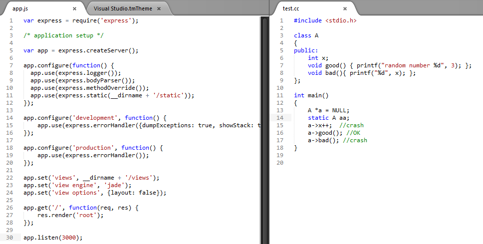

## Visual Studio color scheme for Sublime Text and Texmate

For those used to Visual Studio and switched to other editors, here is the low noise syntax highlighting scheme.

### Installation

#### Sublime Text 2

Drop `Visual Studio.tmTheme` file in: `\Data\Packages\Color Scheme - Default`

#### Textmate

Drop `Visual Studio.tmTheme` file in: ~/Library/Application Suport/TextMate/Themes/